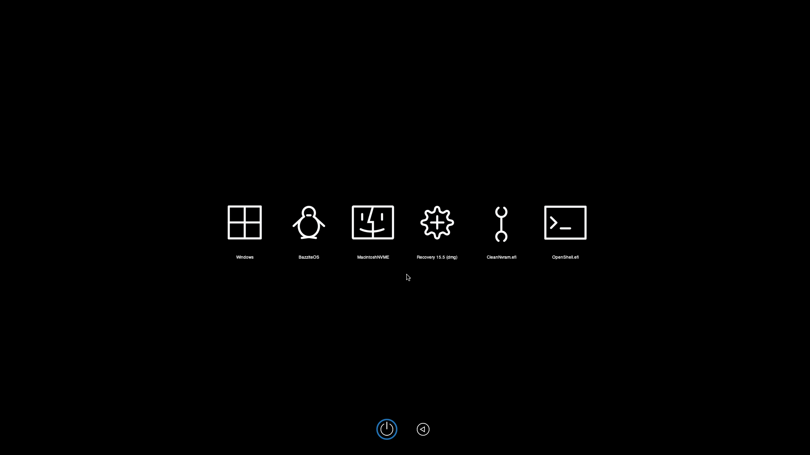

Partial port of [LuckyCrack's](https://github.com/LuckyCrack/OpenCore-Themes) Smooth Dark theme to OpenCore 1.0.4.  
  
Direction / reboot icons are from Acidanthera's stock Syrah Theme as not all Icons were the right size for 1.0.4.
OS, drive, tool and recovery, etc icon are ported.
If I have time I might do a proper port of all their themes.

Setup
- Place Ressources folder in EFI/OC (should only need Image folder, other ressources are already from 1.0.4)
- OC config: Misc > Boot > PickerVariant: 17 (also enables mouse suppor in picker)
  
For custom Linux drive folder: 
- Choose one from Custom-Icons directory
- Place in root of Linux EFI partition
- Due to pickervariant 17, OC will look for it and populate in picker

 

> Credits:
  [LuckyCrack](https://github.com/LuckyCrack/) for Smooth Dark theme
  [Acidanthera](https://github.com/acidanthera) for OpenCore, OpenCanopy, Stock themes
